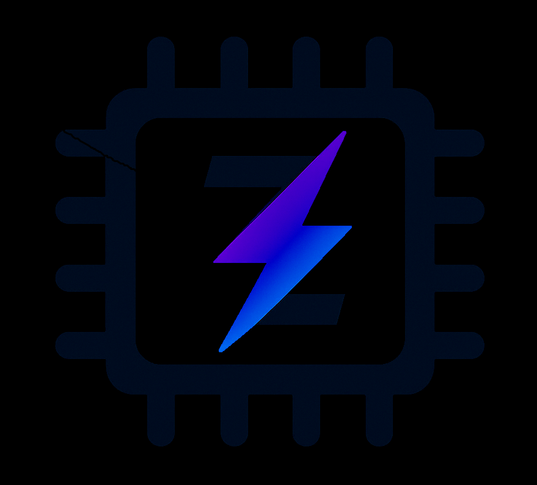

# MemZ

Insipired by [Zanzibar](!https://research.google/pubs/zanzibar-googles-consistent-global-authorization-system/), This project is to implement a distributed authorization read-heavy system

## Goal

- Read-Heavy system
- Distributed with HA and eventually consistence
- High throught + low layency (50k+ qps + p95 < 10ms)
- Memory evaluation
- Focus on performance, not all cases support

## Support model

- RBAC
- Hierarchical RBAC
- Admin
- Object-less
- router
- filesystem
- static abac

## Limit

- dynamic model
- tuples.len > 10e8 use about 10G memory
- single write db, not ideal on write-heavy

## Support protocol

- gRPC
- ConnectRPC
