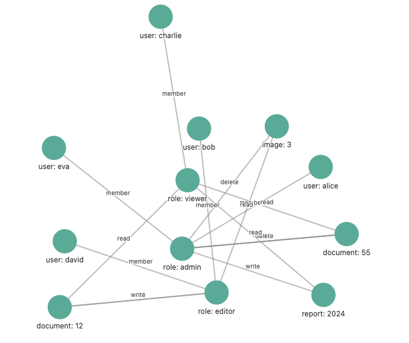

# Summarize

1. Zanzibar-inspired, real-time ReBAC Authorization system
2. Native distributed design with high throughput(10k+ per service rps) with low latency(<1ms)
3. Flexible authorization models capable of handling scenarios ranging from simple to complex
4. OpenTelemetry support, providing comprehensive observability and streamlined troubleshooting
5. Graph and tree visualize with CRD operation on tuples
